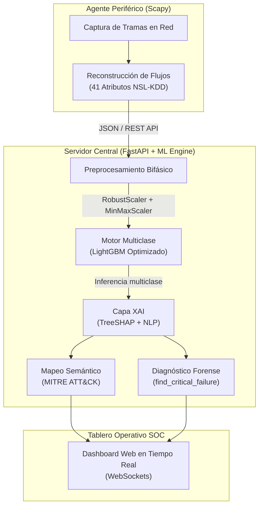

# 🛡️ HunterIDS: Prototipo de IDS con Inteligencia Artificial Explicable (XAI) para Redes SOC

[](https://www.python.org/)
[](https://lightgbm.readthedocs.io/)
[](https://fastapi.tiangolo.com/)
[-8A2BE2.svg)](#)
[](https://opensource.org/licenses/MIT)

**HunterIDS** es un prototipo avanzado de **Sistema de Detección de Intrusiones en Red (NIDS)** distribuido e interpretable, diseñado para centros operativos de seguridad (**SOC**). El proyecto aborda la brecha semántica y la naturaleza de *"caja negra"* de los modelos de aprendizaje automático modernos, integrando un motor de inferencia **LightGBM** optimizado con auditoría post-hoc en tiempo real mediante **TreeSHAP** y traducción automática de alertas al marco táctico **MITRE ATT&CK**.

Este repositorio implementa las investigaciones, metodologías y resultados científicos presentados en el artículo:  
> **"Prototipo de IDS con IA Explicable (XAI) para mejorar la detección de intrusiones en las redes SOC mediante el Dataset NSL-KDD, 2026"**  
> *A. Principe, C. Santana y Y. Tello — Escuela Profesional de Ciberseguridad, Universidad Nacional de Ingeniería (Lima, Perú).*

<p align="center">
  
</p>
<br>

---

## 📌 El Problema en los Centros de Operaciones de Seguridad (SOC)

La adopción de modelos de Aprendizaje Automático (ML) y Deep Learning en la detección de amenazas ha introducido críticas limitaciones en entornos operativos reales:

1. **La "Caja Negra" y Desconfianza Operativa:**  
   Los algoritmos complejos toman decisiones opacas, impidiendo a los analistas de seguridad comprender la lógica subyacente de cada alerta. Esta falta de transparencia genera *"alertas ciegas"*, escepticismo en los operadores y una elevada **fatiga por alertas** que ralentiza la respuesta ante incidentes críticos.
2. **La "Burbuja Estadística" (Sobreajuste en Laboratorio):**  
   Gran parte de las soluciones de la literatura técnica evalúan sus modelos mediante particiones aleatorias internas ($80/20$) sobre un mismo corpus de datos. Esto produce una falsa impresión de eficacia ($>99\%$), enmascarando una memorización de patrones que fracasa drásticamente frente a tráfico desconocido o vectores de ataque de **Día Cero** en redes externas.
3. **Desbalance Severo en Ataques Críticos:**  
   Amenazas silenciosas y de muy bajo volumen, como la escalada de privilegios (*User to Root — `U2R`* y *Remote to Local — `R2L`*), sufren el riesgo de ser absorbidas por clases mayoritarias. Los modelos no ajustados suelen mostrar una precisión cercana al $0\%-1\%$ en estas categorías, perdiendo capacidad de detección proactiva.
4. **Brecha Semántica Analista-Máquina:**  
   Los reportes puramente estadísticos u outputs probabilísticos carecen de justificación auditable según normativas modernas de gobernanza de IA y no ofrecen el contexto táctico necesario para triar y contener un ataque ágilmente.

---

## 💡 La Solución Planteada: Arquitectura HunterIDS

HunterIDS propone una solución integral que equilibra la alta capacidad discriminativa y la agilidad de respuesta en milisegundos con una auditabilidad completa, basada en los siguientes pilares:



### 1. Validación Adversarial Estricta frente a "Día Cero" (`KDDTest+`)
A diferencia de evaluaciones convencionales, HunterIDS se entrena sobre la totalidad de los registros estandarizados de **`KDDTrain+`** (125,973 tramas) y es sometido a una validación externa independiente contra el subconjunto **`KDDTest+`** (22,544 tramas). Este último incluye **17 tipos de ataques de Día Cero** (como `saint`, `mscan`, `httptunnel`) jamás observados durante el entrenamiento, garantizando una **"exactitud honesta"** y realista.

### 2. Preprocesamiento Bifásico de Datos y Retención Granular
* **Fase 1 (`RobustScaler`):** Emplea el rango intercuartílico (IQR) para atenuar la distorsión de varianza generada por valores atípicos (*outliers*) extremos típicos de ataques volumétricos (ej. DoS por conteo masivo de bytes).
* **Fase 2 (`MinMaxScaler` + `OneHotEncoder`):** Normaliza las variables numéricas al intervalo $[0, 1]$ y codifica variables nominales (`protocol_type`, `service`, `flag`) sin imponer jerarquías artificiales.
* **Selección con Información Mutua (`SelectKBest`, $k=100$):** Reduce el espacio expandido (de ~121 atributos) a las 100 variables con mayor dependencia estadística respecto a la clase.
* **Aprendizaje sobre las 40 firmas originales:** El clasificador se entrena directamente sobre las 40 firmas morfológicas del dataset y la consolidación taxonómica en las **5 macro-familias** (`Normal`, `DoS`, `Probe`, `R2L`, `U2R`) se ejecuta post-predicción para facilitar el reporte al SOC.

### 3. Motor LightGBM con Penalización Asimétrica Dinámica
* Para evitar el sobreajuste que afecta a árboles profundos, se regulariza la arquitectura de LightGBM limitando `max_depth=8` y `num_leaves=63`.
* Se implementa una **penalización asimétrica de pesos** (multiplicando **2.5x** el peso de clases minoritarias crudas como `U2R` y regularizando `Normal` a 1.5x), logrando elevar de forma crítica la sensibilidad del modelo ante escaladas de privilegios sin disparar falsas alarmas.

### 4. Inteligencia Artificial Explicable (XAI) mediante TreeSHAP & Mapeo MITRE
* **Auditabilidad Dual (Global y Local):** El explicador `TreeSHAP` calcula las atribuciones exactas de cada variable. A nivel global se generan diagramas *Beeswarm* que identifican características clave (ej. `src_bytes`, `srv_count`, `dst_host_srv_count`); a nivel local, cada alerta genera un gráfico *Waterfall* que justifica ante el analista qué factores motivaron la predicción.
* **Capa NLP y MITRE ATT&CK:** Las variables responsables de la anomalía son interpretadas en lenguaje natural y mapeadas en tiempo real a tácticas y técnicas del marco **MITRE ATT&CK** (ej. manipulación de `num_failed_logins` $\rightarrow$ **T1110 Brute Force**; excesivos `src_bytes` $\rightarrow$ **T1041 Exfiltration Over C2 Channel**).
* **Módulo de Diagnóstico Forense de Fallos (`find_critical_failure`):** Innovación de ingeniería que genera auditorías en cascada (*Waterfall*) específicamente orientadas a Falsos Positivos o Falsos Negativos en condiciones de Día Cero, permitiendo comprender y corregir sesgos o errores heurísticos del modelo.

---

## 📊 Resultados Empíricos y Validación Académica

El desempeño del prototipo frente a la muestra externa adversarial **`KDDTest+`** demuestra un equilibrio óptimo entre resiliencia frente a ataques desconocidos, precisión por clase y agilidad temporal.

> [!IMPORTANT]
> **Exactitud Honesta del 74.43% frente a amenazas de Día Cero:** Aunque numéricamente inferior al >99% de estudios en condiciones de laboratorio con particiones internas, este resultado prueba que el sistema generaliza en entornos realistas de ciberseguridad y no depende de la memorización de firmas.

### 1. Efectividad de Identificación por Categoría Taxonómica
El modelo destacó un salto de rendimiento en la clase **User to Root (`u2r`)**, alcanzando un **40% de precisión** frente al clásico ~1% reportado en modelos sin regularizar, manteniendo robustez casi perfecta frente a ataques de denegación de servicio (**DoS**) y reconocimiento (**Probe**).

| Categoría / Clase | Precisión (Precision) | Exhaustividad (Recall) | F1-Score | Soporte (Support) | Interpretación Operativa en SOC |
| :--- | :---: | :---: | :---: | :---: | :--- |
| **`dos`** (Denial of Service) | **0.96** | **0.79** | **0.87** | 7,458 | Excelente capacidad discriminativa frente a SYN-flood y saturación. |
| **`normal`** (Tráfico Legítimo) | **0.64** | **0.97** | **0.78** | 9,711 | Alta retención del tráfico legítimo con mínima disrupción. |
| **`probe`** (Reconocimiento) | **0.87** | **0.59** | **0.70** | 2,421 | Detección fiable de escaneos de puertos y descubrimiento. |
| **`r2l`** (Remote to Local) | **0.08** | **0.00** | **0.01** | 199 | Limitación teórica de modelos supervisados ante firmas inéditas. |
| **`u2r`** (User to Root) | **0.40** | **0.02** | **0.04** | 200 | **Mejora crítica (+40x en precisión)** gracias a penalización asimétrica. |
| **Exactitud Global (`Accuracy`)** | — | — | **0.7443** | **22,544** | **74.43% de precisión global frente a 17 ataques de Día Cero.** |
| **Promedio Macro (`Macro Avg`)** | **0.5921** | **0.4747** | **0.4781** | 22,544 | Rendimiento ponderado equitativo para todas las macro-familias. |
| **Promedio Ponderado (`Weighted Avg`)** | **0.70** | **0.74** | **0.70** | 22,544 | Rendimiento global coherente con la distribución operacional real. |

### 2. Eficiencia Computacional y Latencia en SOC
La adopción de árboles de crecimiento por hojas (*leaf-wise*) en LightGBM superó en velocidad y agilidad computacional a redes neuronales densas (CNN/GRU), operando exitosamente sin necesidad de aceleración hardware por GPU.

| Dimensión Evaluable | Indicador / Métrica | Resultado Empírico | Unidad / Impacto |
| :--- | :--- | :---: | :--- |
| **Eficiencia de Aprendizaje (D2)** | Tiempo de Entrenamiento | **29.2107 s** | < 30 segundos sobre el corpus íntegro (`KDDTrain+`). |
| **Agilidad de Respuesta (D2)** | Latencia Promedio de Inferencia | **0.082334 ms** | Inferencia ultra-rápida por paquete en tiempo real (< 0.1 ms). |
| **Cobertura Táctica XAI (D1)** | Atribución Media SHAP (`explainability.py`) | **Gráficos SHAP** | Aislamiento preciso de variables top (`src_bytes`, `srv_count`, etc.). |

---

## 🏗️ Estructura del Proyecto

```text
HunterIDS/
├── data/
│   ├── raw/                       # Archivos oficiales NSL-KDD (KDDTrain+.txt, KDDTest+.txt)
│   └── processed/                 # Datasets transformados y espacio de variables (selected_features.json)
├── models/                        # Artefactos serializados (modelo LightGBM y transformadores de escalado)
├── plots/                         # Matrices de confusión y reportes gráficos
├── server/
│   ├── main.py                    # Backend asíncrono en FastAPI + WebSockets + Motor NLP/MITRE ATT&CK
│   ├── requirements.txt           # Dependencias del servidor web
│   ├── static/                    # Archivos CSS/JS del tablero SOC
│   └── templates/                 # Plantillas HTML (Jinja2) para la interfaz operativa SOC
├── agent/
│   ├── agent.py                   # Agente de captura de paquetes (Scapy) y reconstrucción de flujos
│   ├── agente.conf                # Configuración de red y endpoints REST
│   └── requirements.txt           # Dependencias del agente periférico
├── preprocessing.py               # Script de depuración, escalado bifásico y selección mutua de características
├── train.py                       # Script de entrenamiento multiclase LightGBM y penalización asimétrica
├── explainability.py              # Motor de explicabilidad TreeSHAP (Beeswarm, Waterfall y Diagnóstico Forense)
├── test_agent.py                  # Simulador automatizado de tráfico y alertas para testeo rápido del servidor
├── requirements.txt               # Dependencias de Machine Learning y visualización
└── paper.pdf                      # Artículo científico oficial (2026)
```

---

## 🚀 Guía de Ejecución y Despliegue

### Prerrequisitos
* **Python:** 3.9 o superior.
* **Sistema Operativo:** Compatible con Windows, Linux y macOS.
* *(Solo si se ejecuta captura real en red)*: Permisos de Administrador / Root para intercepción pasiva mediante **Scapy** o librería Npcap instalada en Windows.

---

### Paso 1: Instalación de Dependencias Principales
Clona el repositorio e instala las librerías de Ciencia de Datos y Machine Learning en tu entorno virtual:

```bash
git clone https://github.com/PrincipeCoder/HunterIDS.git
cd HunterIDS
pip install -r requirements.txt
```

> [!NOTE]
> Si los datos en crudo no están en `data/raw/`, asegúrate de descomprimir el archivo `data.rar` incluido en la carpeta raíz dentro de la carpeta `data/` del proyecto.

---

### Paso 2: Pipeline de Ciencia de Datos (Preprocesamiento, Entrenamiento y XAI)

1. **Preprocesamiento Bifásico:**  
   Genera los datasets normalizados (`train_processed.csv`, `test_processed.csv`) y selecciona las 100 características más informativas (`selected_features.json`):
   ```bash
   python preprocessing.py
   ```

2. **Entrenamiento del Modelo LightGBM:**  
   Entrena el modelo multiclase aplicando el multiplicador asimétrico $2.5\times$ en `U2R`, evalúa las métricas en `KDDTest+` y almacena el modelo entrenado en `models/`:
   ```bash
   python train.py
   ```

3. **Generación de Explicaciones TreeSHAP y Diagnóstico Forense:**  
   Calcula las atribuciones globales y el diagnóstico automatizado en cascada (*Waterfall*) para anomalías y fallos forenses (`find_critical_failure`):
   ```bash
   python explainability.py
   ```
   *(Los gráficos `beeswarm_test.png`, `waterfall_example.png` y reportes forenses se guardarán en el directorio raíz o en `plots/`).*

---

### Paso 3: Despliegue del Servidor Web SOC (Backend & Dashboard)

El servidor central expone una API REST para recibir vectores de red desde los nodos clientes y un canal **WebSocket** para visualizar alertas con contexto NLP y MITRE ATT&CK en tiempo real en la interfaz del SOC:

1. Instala las dependencias del servidor:
   ```bash
   pip install -r server/requirements.txt
   ```
2. Inicia el servidor mediante `uvicorn` (por defecto en el puerto **8000**):
   ```bash
   python -m uvicorn server.main:app --host 0.0.0.0 --port 8000 --reload
   ```

> [!TIP]
> **Acceso al Tablero Operativo SOC:**  
> Abre tu navegador web en **[http://localhost:8000](http://localhost:8000)**. Podrás observar la interfaz SOC con monitoreo en tiempo real, desglose táctico y modal XAI interactivo.

---

### Paso 4: Despliegue del Agente de Intercepción Periférico

Puedes alimentar el tablero de dos formas:

#### Opción A: Simulación Inmediata de Alertas (Recomendado para Prueba Rápida)
Ejecuta el script simulador que genera flujos artificiales (normales y maliciosos con sus valores SHAP) y los envía vía REST al servidor de forma continua:
```bash
python test_agent.py
```

#### Opción B: Captura Pasiva Real con Scapy (Entorno SOC Periférico)
1. Instala las dependencias del agente:
   ```bash
   pip install -r agent/requirements.txt
   ```
2. Ejecuta el agente con privilegios elevados (requerido para capturar tramas desde tu tarjeta de red):
   ```bash
   # En Linux / macOS:
   sudo python agent/agent.py
   
   # En Windows: Ejecutar terminal de Python como Administrador
   python agent/agent.py
   ```

---

## 👨‍💻 Referencia Científica y Autores

Si utilizas este software o su metodología en tu investigación o entorno operativo, por favor cita el artículo académico:

```bibtex
@article{principe2026hunterids,
  title   = {Prototipo de IDS con IA Explicable (XAI) para mejorar la detección de intrusiones en las redes SOC mediante el Dataset NSL-KDD, 2026},
  author  = {Principe Ostos, Anghelo Kenedy and Santana Palomino, Carlos and Tello Canchapoma, Yury},
  journal = {Universidad Nacional de Ingeniería — Escuela Profesional de Ciberseguridad},
  year    = {2026},
  address = {Lima, Perú}
}
```

* **Anghelo Kenedy Principe Ostos** — *Conceptualización, Metodología, Curación de Datos, Software y Administración del Proyecto.*
* **Carlos Santana Palomino** — *Metodología, Análisis Formal, Recursos, Supervisiones y Redacción.*
* **Yury Tello Canchapoma** — *Validación Metodológica y Revisión Técnica.*

---

<p align="center">
  <b>🛡️ HunterIDS</b> — Transparentando las decisiones algorítmicas para fortalecer la ciberseguridad en Centros de Operaciones de Seguridad.
</p>

